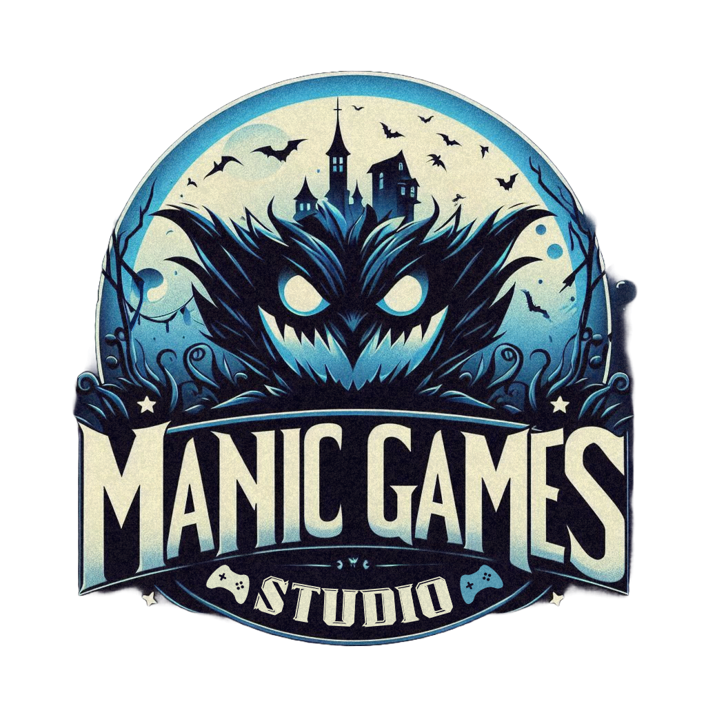
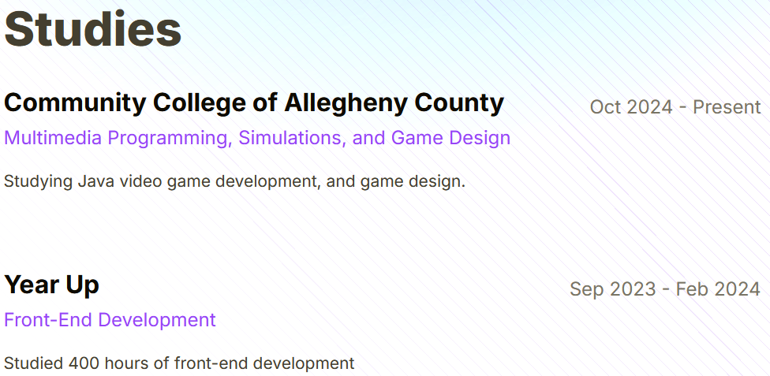
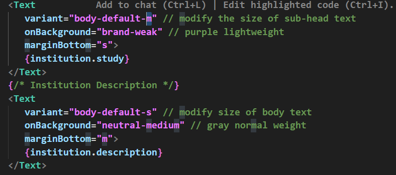
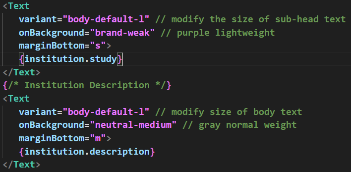
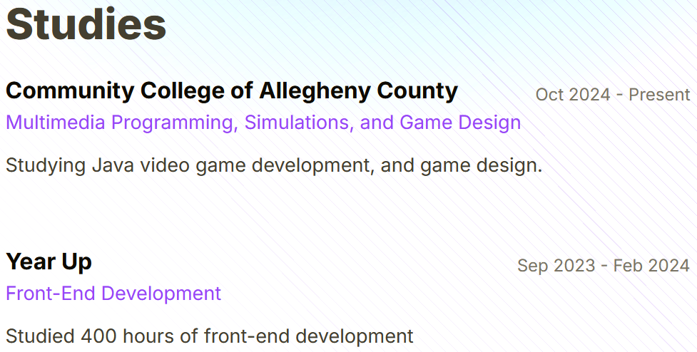

Welcome to my personal developer portfolio, built with [Once UI](https://once-ui.com) for [Next.js](https://nextjs.org).

## **About Me**

I'm DevFaulk, a passionate developer with expertise in web technologies. This portfolio showcases my projects, skills, and experiences in the world of software dev, game dev, and video editing.

## **Projects**

Here are some of my notable projects:

1. **Project A**: Manic Game Studios
2. **Project B**: Jack The Jackrabbit
3. **Project C**: Mountain Views

For more details, visit the [Projects](/work) section.

## **Skills**

- JavaScript/TypeScript
- React.js
- Node.js
- HTML/CSS
- Git
- [Add more relevant skills]

## **Experience**

- **Company X** - Senior Developer (2020-Present)
- **Company Y** - Full Stack Developer (2018-2020)
- **Company Z** - Junior Developer (2016-2018)

For a complete work history, check out my [About/CV](/about) page.

## **Portfolio Documentation**

### UI Decision

#### Manic Page

#### About Page

Easy to read customizable settings for each of my text blocks

Easily modifiable

## **Blog**

I occasionally write about development topics. Check out my latest posts in the [Blog](/blog) section.

## **Contact**

Feel free to reach out to me:

- Email: devfaulk@example.com
- LinkedIn: [DevFaulk](https://www.linkedin.com/in/devfaulk)
- GitHub: [DevFaulk](https://github.com/devfaulk)

## **Portfolio Features**

- Responsive design for all devices
- Built with Once UI and Next.js
- SEO optimized with automatic metadata generation
- Blog and project showcase sections

## **Setup and Customization**

1. Clone the repository
2. Install dependencies with `npm install`
3. Run the dev server with `npm run dev`
4. Edit configuration in `src/app/resources/config`
5. Update content in `src/app/resources/content`
6. Add blog posts or projects in `src/app/blog/posts` or `src/app/work/projects`

## **Acknowledgements**

This portfolio is built using the Magic Portfolio template by [Once UI](https://once-ui.com). Special thanks to Lorant Toth and Zsofia Komaromi for creating this amazing template.

## **License**

This portfolio is based on a template distributed under the CC BY-NC 4.0 License.

- Commercial usage is not allowed.
- Attribution is required.

See `LICENSE.txt` for more information.
